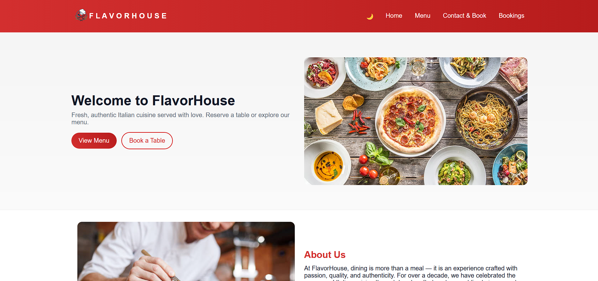

<h1 align="center">🍽️ Modern Restaurant Website</h1> 

<p align="center"> 
   
   
   
</p> 

<p align="center"> A fully responsive and visually appealing <b>Restaurant Website</b> built as part of my <b>Week 4 Internship Project</b>. 
  The website showcases a modern layout with smooth animations, menu highlights, customer testimonials, and a clean UI to provide a great user experience. 
  Designed using <b>HTML, CSS, and JavaScript</b> with a mobile-first approach. 
</p>

---

## 🚀 Live Demo  
🔗 **View Project:** [🍽️ Modern Restaurant](https://saicharanjanagama.github.io/Restaurant/)

📸 **Preview:**  
<p align="center">
  
</p>

---

## 🎯 Features

- 🏠 Beautiful Home Section with hero banner
- 📜 Fully designed Menu Section with pricing
- ⭐ Customer Reviews / Testimonials Slider
- 🍕 Highlighted Featured Dishes
- 📞 Contact Section with Map Integration
- 📱 100% Mobile Responsive
- 🎨 Modern UI with smooth transitions
- 🧭 Sticky Navbar & Easy Navigation
- 🔄 Interactive JavaScript-based animations

---

## 🛠️ Technologies Used

- **HTML5**  
  *(Semantic structure for clean code)*  
- **CSS3**  
  *(Animations, responsive layout, modern styling)*  
- **JavaScript**  
  *(Interactions, toggles, dynamic behaviors)*  
- **LocalStorage API**  
  *(Optional persistence of tasks in browser)*  

---

## 🚀 How to View

To view the project locally:  
```bash
open index.html
```

---

## 👨‍💻 Author

It’s me — **Sai Charan Janagama** 😄<br>
🎓 Computer Science Graduate | 🌐 Aspiring Full Stack Developer<br>
📧 [Email Me](saic89738@gmail.com) ↗<br>
🔗 [LinkedIn](https://www.linkedin.com/in/saicharanjanagama/) ↗<br>
💻 [GitHub](https://github.com/SaiCharanJanagama) ↗

---

## 💬 Feedback

If you have any feedback or suggestions, feel free to reach out!  
Your input helps me improve 🚀
